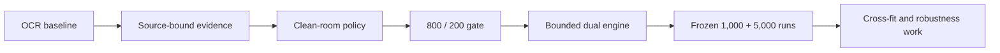

# MIB Doc Challenge — Engineering Roadmap

**Submission:** midasavocado
**Solution:** <https://github.com/midasavocado/mib-doc-challenge-solution>

This memo records how the system evolved, which shortcuts were rejected, what
the frozen candidate actually proves, and where the next week of engineering
should go. Runtime instructions and the component catalogue live in the public
repository's README.

## 1. From strings to evidence

The initial extractor recovered many correct-looking values but flattened how
they were obtained. A clean intake row, incidental policy prose, an OCR guess,
and a foreign-case page could become the same string. Classification therefore
sent many true approvals and denials to review: the emitted value looked
complete, while its authority had been lost.

The first durable change was to bind every observation to the active case,
physical page type, labeled row, source program, and legibility state. Narrow
rotation, deskew, faded-ink, and high-resolution readers improved extraction.
More importantly, they distinguished observed, unreadable, absent, and
contradictory evidence. Late field repair moved behind a frozen decision
boundary so prettier output could not silently become policy authority.

## 2. Clean-room policy rebuild

An earlier participant-derived provenance package was removed. The active
evidence audit, terminal policy, bridge, and writer were authored locally from
the organizer's PDFs, schema, field manual, and evaluator. Engine A now follows
a stable precedence: authenticated active-case finding; positive visible
denial witness; material conflict or uncertainty; affirmative multisource
approval; otherwise `NEEDS_REVIEW`.

This phase also exposed seductive public residuals: name fragments, exact
sponsors, tiny conjunctions, and hidden answer-like text could separate cases
almost perfectly. Case-specific rules and failed trained models were deleted.
The primary engine retained broad source topology, program authority, and
symmetric safety vetoes instead.

## 3. Generalization gate

Development used a deterministic 800-packet partition. A separate 200-packet
boundary returned aggregate section scores, validity counts, and catastrophic
false-approval count only; it was not used for per-case diagnosis. The boundary
is disclosed as repeatedly queried aggregate validation, not a pristine
scientific holdout.

A full-fit classifier looked excellent on its fitting rows but produced only
72.20/80 classification and seven catastrophic false approvals in five
internal 640/160 audits. Text, graph, neural, and residual-cell experiments
were likewise rejected when they failed folds, encoded identity-like cells, or
created approval without affirmative authority. The promoted Engine-A safety
anchor measured 138.2286/150 on development and 135.1749/150 on aggregate
validation, both with zero catastrophic false approvals.

## 4. Bounded dual engine

Engine B is a separately feature-flagged second opinion fit to all 1,000 public
training labels. It contains two locally generated CatBoost heads and public
residual policy hypotheses, but no case-ID answer map, validation labels, or
manual output rows. It is explicitly benchmark-adaptive; private transfer is
unproven.

The first bridge allowed B to resolve every Engine-A review and replayed at
146.5924/150 on the public artifact. That was a useful ceiling, not transfer
evidence. The frozen arbiter is more conservative:

- an Engine-A denial or authenticated approval always wins;
- a decisive B result may resolve only an Engine-A review, after common fee,
  risk, medical, conflict, and authority vetoes;
- B abstention may demote an unsigned approval only in repeated identity-free
  review families; and
- after extraction freezes, a cache-backed refresh examines only materially
  incomplete unsigned approvals. A refreshed B denial can produce review,
  never denial or approval.

Bridge confidence is not fixed at 0.90. A and B share inputs, so their signals
are correlated. The arbiter discounts that correlation, combines A
reliability, B strength, and evidence completeness, subtracts an approval-risk
margin, and bounds bridge confidence between 0.62 and 0.93.

## 5. Frozen release evidence

| Boundary | Extraction | Classification | Calibration | Total | CFA |
|---|---:|---:|---:|---:|---:|
| Exact constrained public 1,000 | 46.9478 | 76.9800 | 18.3819 | **142.3097** | 0 |
| Generalized Engine A, development 800 | 46.9028 | 73.4500 | 17.8758 | **138.2286** | 0 |
| Aggregate-only 200 | 46.7389 | 71.5000 | 16.9360 | **135.1749** | 0 |

The exact 1,000 run completed in 3,624.11 seconds (3.62411 seconds/PDF)
under the organizer's offline 4-vCPU/8-GiB contract. The identical
217,919,202-byte ARM64 image then processed all 5,000 unlabeled validation
packets in 19,717.37 seconds (3.943474 seconds/PDF). The output contains 5,000
unique complete rows, exactly matches the manifest, and passes both the
organizer validator and an independent schema audit. Artifact SHA-256:
`85ca045b1a5a652d6cc9d041966bee05cba17fc75675ef3be10ecccbb517b536`.
No validation labels or private score were available.

## Next week

1. Replace public-fit Engine B with identity-free, source-state heads trained
   and calibrated inside nested folds.
2. Learn agreement, disagreement, and abstention confidence jointly rather
   than calibrating a moving routing stack.
3. Fuse the Tesseract and RapidOCR schedulers around one immutable raster cache
   while retaining selective audit.
4. Replace submission-wide vocabulary repair with a fixed development-derived
   vocabulary so singleton and batch behavior are identical.
5. Generate unseen layout and damage controls; require zero-CFA transfer before
   granting any broader approval authority.

The main lesson is gloriously unglamorous: durable gains came from preserving
evidence provenance. Spectacular shortcuts usually melted when shown a held
fold.
